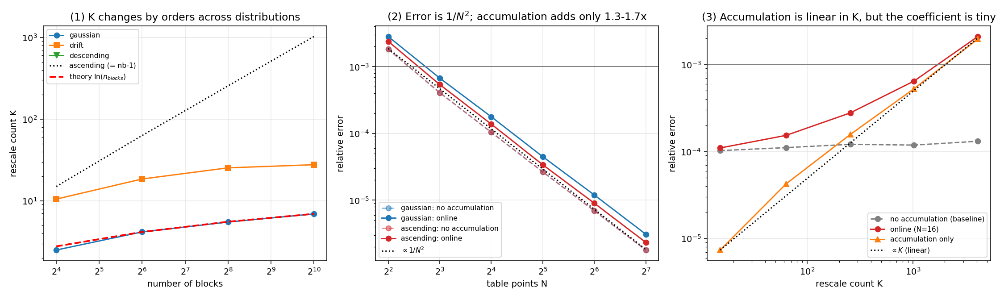
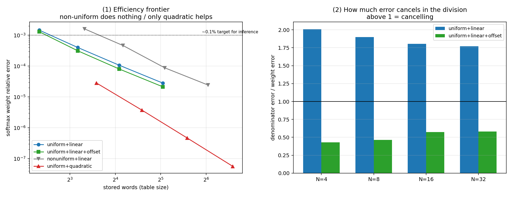

# Error behaviour of LUT-based exponentials in online softmax

A small empirical study of how table-based `exp` approximation errors behave inside
the online-softmax recurrence (Milakov & Gimelshein, 2018) used by FlashAttention-style
kernels, and what that implies for the design of a hardware exponential unit.

**Status:** exploratory / work-in-progress. All results are reproducible with the
scripts here (pure Python + NumPy, no hardware required). Corrections and pointers to
prior art are welcome — see [Scope and prior art](#9-scope-and-prior-art).




---

## TL;DR

1. **Rescaling is rare.** The number of rescale events `K` grows as `ln(n_blocks)`,
   not linearly. For 1024 blocks, `K ≈ 7`.
2. **Error accumulation through rescaling is self-attenuating.** It is linear in `K`,
   but the per-rescale contribution is ~270× smaller than the single-shot
   approximation error `ε`. A naive `K·ε` bound is far too pessimistic.
3. **Systematic bias cancels in the softmax division.** Minimising the *magnitude*
   of the approximation error — the textbook minimax objective — is largely wasted
   effort here. What matters is the *ripple* (spread) of the relative error, because
   any constant multiplicative bias divides out exactly.
4. **Uniform table spacing is optimal for `2^f`**: `(2^f)''/(2^f) = (ln 2)²` is
   constant, so the relative interpolation error is already equalised across the whole
   interval. Curvature-adaptive spacing gains nothing (measured 0.97–1.09×) at 2× the
   storage.
5. **In a fixed-point model, both (2) and (3) survive, and the accumulator width — not
   the table — sets the precision floor.** Spend bits on the accumulator; keep the
   table small.

---

## 1. Background

### Online softmax

Softmax needs a global normaliser `Σ exp(xⱼ)` and a global maximum for numerical
safety, so a naive implementation makes three passes over the score matrix. Online
softmax collapses this to one streaming pass by keeping a running maximum `m` and a
running sum `l`, correcting `l` whenever `m` increases:

```
for each block:
    m_new = max(m, block.max())
    if m_new > m:
        l = l * exp(m - m_new)      # rescale  <- the operation of interest
        K = K + 1
    l = l + sum(exp(block - m_new))
    m = m_new
```

This is the core of FlashAttention. The entire state is two registers.

### Why the exponential unit matters

`exp` is the only transcendental op in the datapath. The standard hardware
construction is:

1. **Range reduction.** `exp(x) = 2^(x·log2e) = 2^i · 2^f` with `i = floor(y)`,
   `f = y - i`. The `2^i` factor is an exponent-field addition and is *exact*. The
   `log2e` factor folds into the preceding QK scaling, so the unit only ever computes
   `2^f` for `f in [0,1)`. A softmax temperature `T` folds into this same constant as
   `log2e / T`, so temperature scaling costs no extra hardware.
2. **Table lookup + interpolation** for `2^f`: high bits index the table, low bits are
   the interpolation weight. No division.

Open question: **how large must that table be, given its error is fed back into an
accumulator `K` times?**

---

## 2. Method

Two implementations share the *same* approximate `exp`:

| method | passes | rescaling | isolates |
|---|---|---|---|
| `denom_three_pass` | 3 | none | approximation error only |
| `denom_online` | 1 | yes | approximation + accumulation |

Their difference isolates the accumulation term; a float64 three-pass computation is
the reference. Distributions: `gaussian` (N(0,4²), realistic), `descending` (best,
K=0), `ascending` (adversarial, K=n_blocks−1), `drift` (intermediate). Table
constructions: uniform+linear, uniform+linear+offset (minimax-shifted), curvature
non-uniform+linear, uniform+quadratic. Block size 64; 8–12 seeds per point.

---

## 3. Results

### 3.1 Rescale count follows `ln(n_blocks)`

| blocks | measured `K` | `ln(blocks)` | ratio |
|---|---|---|---|
| 16 | 2.50 | 2.77 | 0.90 |
| 64 | 4.17 | 4.16 | 1.00 |
| 256 | 5.50 | 5.55 | 0.99 |
| 1024 | 6.92 | 6.93 | 1.00 |

The classical expected-number-of-records result. The adversarial `ascending` case
reaches `K = n_blocks − 1`, but that requires monotonically increasing scores, which
does not occur in practice.

### 3.2 Accumulation is linear in `K` but heavily attenuated

The interpolation error is systematically positive (`2^f` is convex, so a linear
interpolation chord lies strictly above it, making 100 % of errors positive), so
accumulation *can* happen. On the adversarial `ascending` input, `N = 16`:

| quantity | value |
|---|---|
| error per rescale | 4.79e-07 |
| single-shot approx error `ε` | 1.31e-04 |
| attenuation factor | **0.0037** (≈ 1/274) |

A rescale multiplies `l` by `exp(m_old − m_new) < 1`, shrinking the accumulated
*error* by the same factor as the accumulated *value*. Many rescales ⇒ each factor is
small. Even at length 262144 with every block triggering a rescale, a 16-point table
keeps the denominator error below 0.2 %.

### 3.3 Systematic bias cancels in the division (main finding)

A minimax offset (shifting entries so the error is balanced) is free in hardware and
improves the **denominator** error 4–5×, but not the quantity that matters, the
softmax **weights**:

| scheme (N=16) | denominator error | weight error |
|---|---|---|
| uniform + linear | 1.91e-04 | 1.06e-04 |
| uniform + linear + offset | 4.60e-05 (4.2× better) | 8.00e-05 (1.3× better) |

Decomposing the relative error:

| scheme (N=16) | mean | ripple (max − min) |
|---|---|---|
| uniform + linear | +1.564e-04 | 2.346e-04 |
| uniform + linear + offset | +3.909e-05 | 2.346e-04 |

The ripple is identical; only the mean differs. A constant multiplicative factor `c`
cancels exactly in `c·exp(xᵢ) / Σ c·exp(xⱼ)` — this part is an identity, not just an
observation. The empirical content is that the LUT error's dominant component *is*
approximately such a constant factor.

```
systematic (+1%):  [2.02, 1.01, 1.01] -> [0.5000, 0.2500, 0.2500]   exact
scattered  (±1%):  [2.02, 0.99, 1.01] -> [0.5025, 0.2463, 0.2512]   wrong
```

> **Design implication.** A softmax exp unit should minimise the *ripple* of the
> relative error, not its maximum absolute value. Standard minimax approximation
> optimises the wrong quantity here; a consistent multiplicative bias is free.

### 3.4 Uniform spacing is already optimal for `2^f`

Linear-interpolation relative error scales as `(h²/8)·g''/g`, where `g` is the
function being approximated. For `g(t) = 2^t`, `g''/g = (ln 2)² = 0.480453`, constant
(measured min = max over [0,1]). So uniform spacing already equalises relative error. Curvature-adaptive spacing: measured gain
0.97–1.09× (none) at 2× storage and a non-bit-sliceable address. This also refutes
"inputs cluster near zero, so make the table denser there" — range reduction maps
every input onto `f ∈ [0,1)` roughly uniformly, so the input distribution never
reaches the table.

### 3.5 Quadratic interpolation: effective, bad trade on small FPGAs

| scheme | words | multipliers | weight error |
|---|---|---|---|
| uniform + quadratic, N=4 | 12 | 2 | 2.8e-05 |
| uniform + linear, N=32 | 33 | 1 | 2.8e-05 |

Quadratic buys 21 words for one extra multiplier — a loss on a LUT-rich, DSP-scarce
FPGA; the balance reverses on an ASIC or when the accuracy is genuinely needed.

### 3.6 Fixed-point model: findings survive; the accumulator dominates

§3.1–3.5 use float64 with an exact table. A bit-accurate integer model quantises table
entries to `F` fractional bits and does interpolation/accumulation/rescale as integer
multiply/shift, with exp outputs and accumulator `l` at `ACC` fractional bits (state
in arbitrary-precision `int`).

Metric note: "mean relative error over all weights" is misleading — most weights are
negligible (~1e-10) and underflow, dominating that average with terms that do not
affect the output. Proper metrics: **L1 distance** `0.5·Σ|p−p_ref|` and **attention
output error** on `Σ pᵢvᵢ`.

Both findings hold under quantisation:

- **Bias cancellation:** the offset yields identical output error with/without it
  (e.g. `3.542e-2` both ways at F=10), as in float64.
- **Self-attenuation:** as `K` grows 15 → 1023 (68×) the output error grows only
  1.3e-3 → 2.4e-3 (< 2×). No blow-up.

Bit-budget sweep (N=16, one parameter reduced at a time):

| parameter reduced | effect on output error |
|---|---|
| argument bits `FB`: 8 → 16 | 0.68 % → 0.56 % (barely matters; 8 bits suffice) |
| table bits `F`: 6 → 14 | 20 % → 0.56 % (matters) |
| **accumulator bits `ACC`: 8 → 18** | **8.7 % → 0.057 % (dominant)** |

**The precision limiter is the accumulator's dynamic range, not the exp table** —
consistent with production FlashAttention accumulating in FP32. Guidance: keep the
table small, spend the bit budget on the accumulator. `ACC ≈ 18, F ≈ 14, FB ≈ 8–10`
reaches sub-0.1 % output error at N=16.

---

## 4. Recommended configuration

```
2^f approximation, f in [0,1)
  uniform 16-point table + linear interpolation
  17 stored words, 1 multiplier, 2 adders, 2 shifts
  address = high bits, interpolation weight = low bits
  no offset correction (buys almost nothing after the division)
  pair with an accumulator of >= ~18 fractional bits (this sets the floor)

  softmax weight error (float64 table): 0.011 %
  attention output error (fixed point, ACC=18, F=14): 0.057 %
```

---

## 5. Repository layout

```
online-softmax-lut-error/
├── README.md
├── LICENSE
├── requirements.txt
├── references.bib
├── online_softmax_error.py   # §3.1-3.2 rescale count + accumulation
├── make_plots.py             # figure 1 + numerical verification
├── table_variants.py         # §3.3-3.5 table construction comparison
├── plot_variants.py          # figure 2 + numerical verification
├── fixedpoint_model.py       # §3.6 bit-accurate integer model
├── fixedpoint_v2.py          # §3.6 corrected metrics + bit budget
└── figures/                  # generated PNGs
```

---

## 6. Reproducing

```bash
pip install -r requirements.txt
python3 online_softmax_error.py    # rescale count and accumulation tables
python3 make_plots.py              # -> figures/online_softmax_error.png + checks
python3 table_variants.py          # table construction comparison
python3 plot_variants.py           # -> figures/table_variants.png + checks
python3 fixedpoint_model.py        # bit-accurate integer model
python3 fixedpoint_v2.py           # fixed-point: findings survive + bit budget
```

Requires NumPy and Matplotlib only.

---

## 7. Limitations

- §3.1–3.5 are float64 with an exact table. §3.6 adds table-entry and accumulator
  quantisation, but still models a single isolated exp/softmax unit — not a full
  attention datapath with quantised Q·Kᵀ and the V matmul, and not a synthesised
  design (no gate-level timing/rounding).
- Only the denominator, the softmax weights, and the single-head output `Σpᵢvᵢ` are
  measured. End-to-end task accuracy (perplexity) is not.
- Score distributions are synthetic. Real attention logits are approximately Gaussian
  but have outliers and head-dependent scaling.
- No RTL yet; area/power are inferred from operation counts, not synthesis.

---

## 8. Next steps

- RTL as a RISC-V custom function unit (CFU-Playground / VexRiscv)
- Measurement vs a software baseline on the same core (cycles, LUT/DSP, power)
- Validation on real attention logits from a trained model
- End-to-end accuracy with the unit in a small transformer

---

## 9. Scope and prior art

This note is deliberately narrow. It is **not** a claim of large area savings: in
published accelerators the softmax/exp block is a small fraction of area (e.g. ITA
reports softmax ≈ 3.3 %, with the MAC/PE array dominating), so shrinking the exp unit
does not significantly change chip-level area or power. The contribution is the *error characterisation*
and the resulting design guidance, not a faster chip.

Adjacent work is extensive: online softmax (Milakov & Gimelshein, 2018), FlashAttention
(Dao et al., 2022; Dao, 2023), the exponent-field bit trick (Schraudolph, 1999),
range reduction / minimax approximation (Muller, 2016), and recent softmax/attention
accelerators (ITA; FLASH-D; INT-FlashAttention; SOLE). Small LUT + range reduction +
piecewise-linear interpolation is already standard practice; the novel part here is
the analysis of error *propagation through the online-softmax rescale recurrence* and
the *bias-cancellation* property of §3.3, for which I did not find a direct prior
reference. Corrections welcome.

See `references.bib`. **Note:** arXiv IDs for the recent-accelerator references were
gathered from web search and should be verified before formal citation.

## License

MIT — see [LICENSE](LICENSE).
